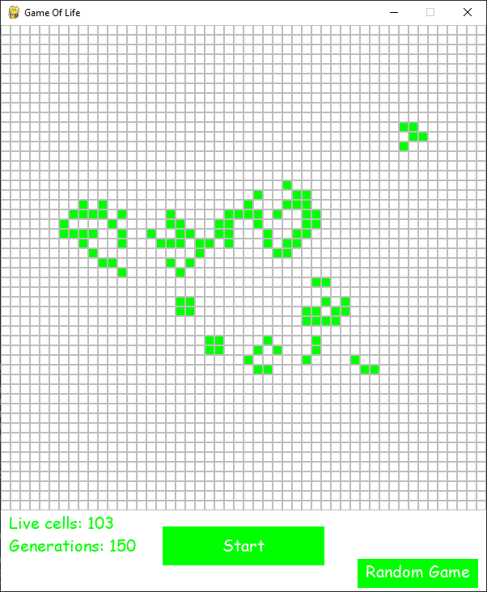
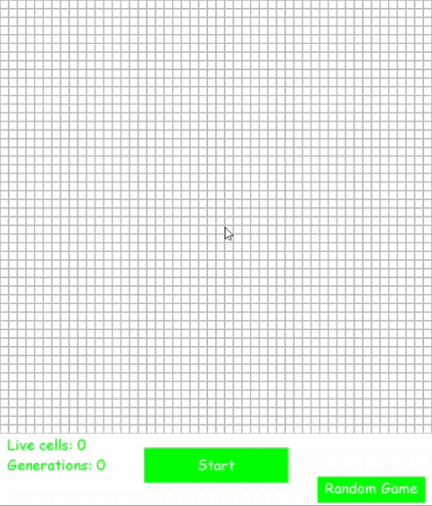

# GAME OF LIFE
[game of life on wikipedia](https://en.wikipedia.org/wiki/Conway%27s_Game_of_Life)

The "Game of Life" is played on a 50 x 50 square grid, where all cells start in a "dead" state, represented by 0.
Before the first move, the player can select a number of cells to "come to life," changing their state from 0 to 1.

The game progresses in "generations." In each generation, the state of the board is updated based on the previous generation's. The future state of each cell is determined by its eight neighbors (cells that are horizontally, vertically, or diagonally adjacent).

### according to the following rules:

### These rules are summarized as B3/S23:
B3: A cell is born if it has 3 living neighbors.

S23: A cell survives if it has 2 or 3 living neighbors.
In all other situations, the cell remains or becomes dead.

#### A living cell (value 1) will die (change to 0) if:
 - It has fewer than 2 living neighbors.
 - It has more than 3 living neighbors.

#### A cell will live (remain or change to 1) if:
 - It is currently alive and has 2 or 3 living neighbors (survives to the next generation).
 - It is currently dead and has exactly 3 living neighbors (a new cell is born).

## custom game
When running `custom_game.py`, you can modify the game rules.

If no rule or an incorrect rule (B{number}/S{two numbers}) is provided, the game will run with the default B3/S23 rule that listed above.

---

### Images:
#### Start of the game

#### Game in generation 150

#### Random game

#### Game running

---

uses the pygame library

test coverage report: 100%

An exercise from Yam Mesica Python course.
